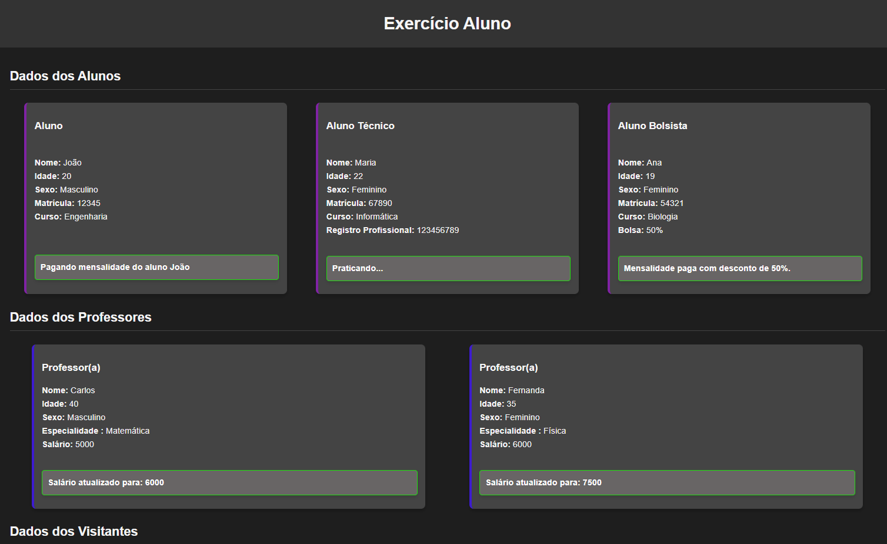

## 📚 Exercício: Alunos, Professores e Visitantes
Este exercício simula o gerenciamento de informações sobre alunos, professores e visitantes utilizando conceitos de Programação Orientada a Objetos em PHP. O projeto demonstra a criação e manipulação de objetos, com classes que representam as diferentes entidades e exibem suas informações de maneira interativa.

## 🧠 Conceitos abordados
- Programação Orientada a Objetos (POO) em PHP

- Herança e polimorfismo

- Encapsulamento de atributos com getters e setters

- Métodos abstratos e sobrescrita de métodos

- Manipulação de objetos e exibição de dados via PHP e HTML

- Estilo visual com CSS para a apresentação de dados

## 📄 Estrutura dos arquivos
- `Pessoa.php`: Define a classe Pessoa, que contém atributos comuns como nome, idade e sexo, e métodos como `fazerAniversario()` e `apresentar()`.

- `Aluno.php`: Define a classe Aluno, que herda de Pessoa e adiciona atributos como matrícula e curso. Contém métodos como `pagarMensalidade()` e `apresentar()`.

- `Bolsista.php`: Define a classe Bolsista, que herda de Aluno e inclui o atributo bolsa, com o método `pagarMensalidade()` personalizado.

- `Tecnico.php`: Define a classe Tecnico, que herda de Aluno e inclui o atributo "registro profissional", com o método `praticar()`.

- `Professor.php`: Define a classe Professor, com atributos como especialidade e salário, e o método `receberAumento()`.

- `Visitante.php`: Define a classe Visitante, que herda de Pessoa e possui um identificador único.

- `index.php`: Arquivo principal que instancia objetos de todas as classes e exibe suas informações na página.

- `style.css`: Arquivo de estilo para formatar visualmente as informações exibidas na página.

## 💻 Demonstração do funcionamento
Ao acessar o index.php, o navegador exibirá informações sobre alunos, professores e visitantes. Cada tipo de pessoa é mostrado em cards, e as ações realizadas sobre os objetos (como pagar mensalidade, praticar e receber aumento) são refletidas dinamicamente:

- Exibe as informações detalhadas de alunos, professores e visitantes.

- Permite interagir com os objetos, acionando métodos como pagarMensalidade(), praticar() e receberAumento().

- A interface é estilizada com CSS para uma apresentação moderna e limpa.

### ⌨  Exemplo básico de como utilizar as classes:

```php
<?php
// Incluindo as classes
require_once 'Aluno.php';
require_once 'Tecnico.php';
require_once 'Bolsista.php';
require_once 'Professor.php';
require_once 'Visitante.php';

// Criando um aluno
$aluno = new Aluno("João", 20, "Masculino", "12345", "Engenharia");
$aluno->apresentar();
$aluno->pagarMensalidade();

// Criando um técnico
$tecnico = new Tecnico("Maria", 22, "Feminino", "67890", "Informática", "123456789");
$tecnico->apresentar();
$tecnico->praticar();

// Criando um bolsista
$bolsista = new Bolsista("Ana", 19, "Feminino", "54321", "Biologia", 50);
$bolsista->apresentar();
$bolsista->pagarMensalidade();

// Criando um professor
$professor = new Professor("Carlos", 40, "Masculino", "Matemática", 5000);
$professor->apresentar();
$professor->receberAumento(1000);

// Criando um visitante
$visitante = new Visitante("Lucas", 25, "Masculino", "123456789");
$visitante->apresentar();
?>
```

---

## 📷 Exemplo de saída



---

## 📌 Como executar localmente

1. **Instale um servidor local**  
   - [XAMPP](https://www.apachefriends.org/pt_br/index.html) (recomendado)  
   - [WAMP](https://www.wampserver.com/en/)

2. **Verifique se o PHP está instalado**
   Certifique-se de que o PHP está instalado corretamente pelo terminal digitando:
   ```bash
   php -v
   ```

3. **Escolha um editor de código**  
   - [Visual Studio Code](https://code.visualstudio.com/) (recomendado)  
   - [Sublime Text](https://www.sublimetext.com/)  
   - [PHPStorm](https://www.jetbrains.com/phpstorm/)

4. **Coloque os arquivos no diretório do servidor local**  
   Exemplo com XAMPP:  
   `C:\xampp\htdocs\exercicio-lutador`

5. **Inicie o Apache no XAMPP**

6. **Acesse no navegador:**  
   `http://localhost/php/phpPOO/exercicio-lutador`

---

## 👨‍💻 Autor

Desenvolvido por João Victor — baseado nos exercícios do [Curso em Vídeo - PHP](https://www.cursoemvideo.com/curso/php-poo/)