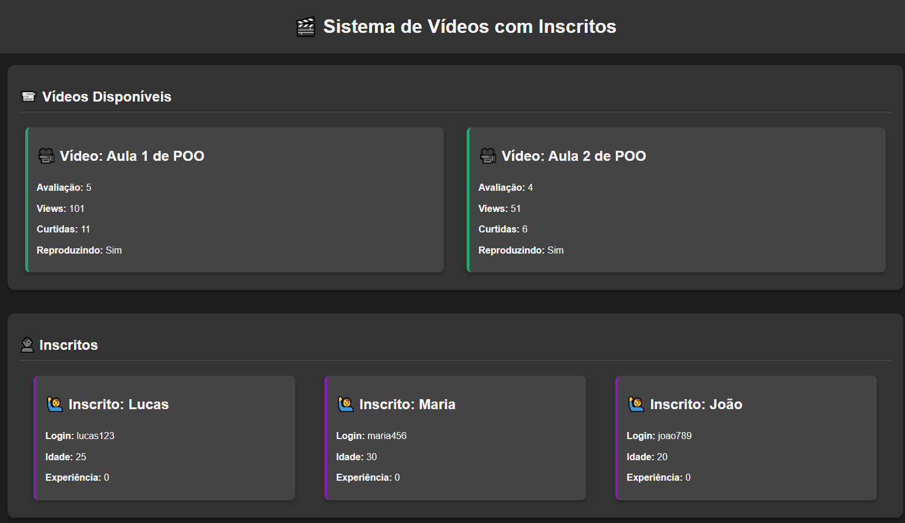

# 🎬 Exercício: Sistema de Vídeos com Inscritos

Este exercício simula um sistema de gerenciamento de vídeos, onde inscritos podem assistir aos vídeos, curtir, avaliar e ganhar experiência com base nas interações. O sistema utiliza conceitos de Programação Orientada a Objetos em PHP, com classes como `Video`, `Inscrito`, e `Pessoa`, além de uma interface `AcoesVideo` para definir métodos que as classes de vídeos devem implementar.

---

## 🧠 Conceitos abordados

- Programação Orientada a Objetos (POO) em PHP
- Encapsulamento de atributos (getters e setters)
- Implementação de interfaces em PHP
- Métodos de interação entre inscritos e vídeos
- Estilo visual com CSS para exibição dos vídeos e inscritos

---

## 📄 Estrutura dos arquivos

- `AcoesVideo.php`: Define a interface `AcoesVideo`, que estabelece os métodos que os vídeos devem implementar (play, pause, like, dislike, details).
- `Pessoa.php`: Define a classe abstrata `Pessoa`, que contém atributos e métodos básicos para o gerenciamento de pessoas (como nome, idade, sexo e experiência).
- `Video.php`: Define a classe `Video`, que implementa a interface `AcoesVideo` e manipula os vídeos (reproduzir, curtir, avaliar, exibir detalhes).
- `Inscrito.php`: Define a classe `Inscrito`, que estende a classe `Pessoa` e adiciona funcionalidades de login e acompanhamento de vídeos assistidos.
- `index.php`: Arquivo principal que instancia objetos `Video` e `Inscrito`, exibe as informações dos vídeos e dos inscritos e permite interações.
- `style.css`: Arquivo de estilo para a formatação visual das informações dos vídeos e dos inscritos.

---

## 💻 Demonstração do funcionamento

Ao acessar o `index.php`, o navegador exibirá os vídeos disponíveis e os inscritos no sistema. Cada vídeo terá informações como avaliação, número de curtidas, views e se está sendo reproduzido. Além disso, as informações dos inscritos, como nome, idade, experiência e login, serão apresentadas.

Exemplo básico de como utilizar as classes:

```php
<?php
// Implementando Classes
require_once 'Pessoa.php';
require_once 'Video.php';
require_once 'AcoesVideo.php';
require_once 'Inscrito.php';

// Criando vídeos
$video1 = new Video("Aula 1 de POO");
$video1->setAvaliacao(5);
$video1->setCurtidas(10);
$video1->setViews(100);
$video1->play();
$video1->like();

// Criando inscritos
$p1 = new Inscrito("Lucas", 25, "M", "lucas123");
$p1->assistirVideo($video1);
$p1->ganharExperiencia(10);

// Exibindo as informações do vídeo e do inscrito
echo $video1->details();
echo $p1->apresentar();
?>
```

---

## 📷 Exemplo de saída




---

## 📌 Como executar localmente

1. **Instale um servidor local**  
   - [XAMPP](https://www.apachefriends.org/pt_br/index.html) (recomendado)  
   - [WAMP](https://www.wampserver.com/en/)

2. **Verifique se o PHP está instalado**
   Certifique-se de que o PHP está instalado corretamente pelo terminal digitando:
   ```bash
   php -v
   ```

3. **Escolha um editor de código**  
   - [Visual Studio Code](https://code.visualstudio.com/) (recomendado)  
   - [Sublime Text](https://www.sublimetext.com/)  
   - [PHPStorm](https://www.jetbrains.com/phpstorm/)

4. **Coloque os arquivos no diretório do servidor local**  
   Exemplo com XAMPP:  
   `C:\xampp\htdocs\exercicio-video`

5. **Inicie o Apache no XAMPP**

6. **Acesse no navegador:**  
   `http://localhost/php/phpPOO/exercicio-video`

---

## 👨‍💻 Autor

Desenvolvido por João Victor — baseado nos exercícios do [Curso em Vídeo - PHP](https://www.cursoemvideo.com/curso/php-poo/)